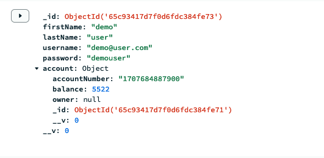
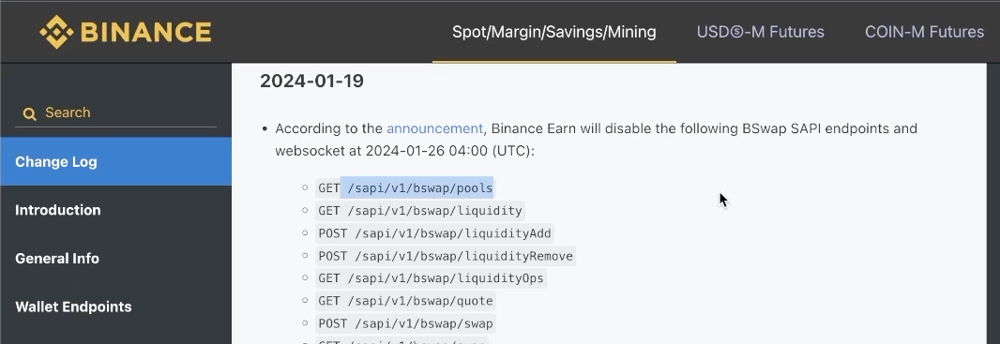
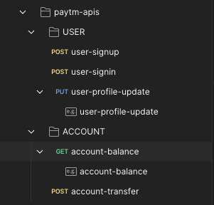

# PayTM Clone [week 8.2]

## 1. Get the mongoDB connection String

- Go to https://www.mongodb.com/cloud/atlas and create a new cluster
- Add your IP address in Network Access section of Atlas UI (Allow access from anywhere)

## 2. Create a User Schema using mongooseJS

- `Required:` username, password, firstName
- `unique:` username
- `Model`: User
- Account will be placed first as it needs to be linked to the User document
- This is how user document would look:
  

## 3. Create an express server with routes

```javascript
const userRouter = require("./routes/userRouter");
app.use("/api/v1/users", userRouter);
```

## 4. Other required dependencies

- jsonwebtoken, cors.
- create config file to export `JWT_SECRET` that can later be used as `config.JWT_SECRET`
- CORS is needed because our frontend will be running on localhost:3000 while backend will run on localhost:5000.

**app.use(cors())**

**Q.** What is CORS and why is it necessary in Development?
**A.** `Cross Origin Resource Sharing(CORS)` is security enhancement feature in dev environment that allows web applications running on one domain to interact with resources from another domain example: Backend runs on https://localhost:3000/ whereas frontend by default runs on https://localhost:5000/. It uses HTTP under the hood to allow request from a different port as per the Same-Origin Policy (SOP).

We can use application performance monitoring (APM) tools or error tracking services to monitor CORS errors and receive alerts or notifications when they occur.

## 5. Validation

- zod library for validation: `npm i zod`
- input validation: `backend/validation/inputValidation.js` using zod schema.

## 6. Middlewares

- index.js uses two middlewares `app.use(cors())` && `app.use(express.json())`
- Authorization middlware that verifies the JWT token: `backend/middlwares/auth.js`
- Authorization is for `/signin` route to generate `jsonwebtoken`

# Transactions

- A bank should never store amounts in decimals. Therefore, `Math.floor()` is used when initializing the balance while account creation / signup.
- The bank should have the sum of the amount all the users hold.
- Example: If user 1 has Rs. 1000 and user 2 has 100 rs. the bank should hold their sum that is Rs. 1100
- Ability to revert a transaction if it did not go through.

---

# Routes

The routes should have some prefix like `api/v1` in this case to have some flexibility.
Otherwise if a backend api changes tomorrow, it would have some different name altogether.

This is how Binance has done it:



# USERS

### /api/v1/users/signup : POST {username, password, firstName, lastName} -->> returns {user document}.

### /api/v1/users/signin : POST {username, password} -->> returns {token}

### /api/v1/users/profile/update : PUT {keys : values}, {auth : token} -->> returns {user} without 'password' field.

---

# ACCOUNT

### /api/ve/account/balance: GET {Authorization} -->> returns balance (of authenticated user).

### /api/v1/account/:id/transfer : PUT {to, amount} + {Authorization} -->> transfers money from one account to another


